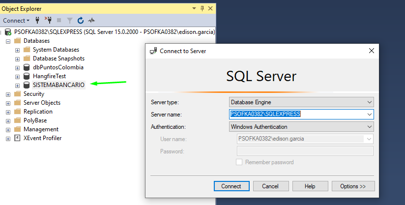
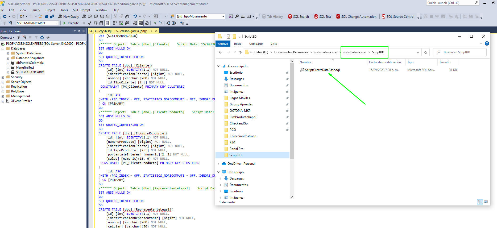
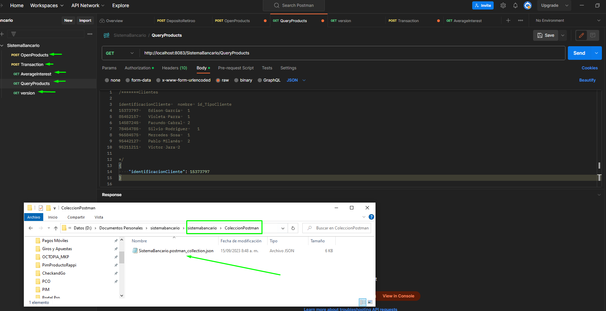
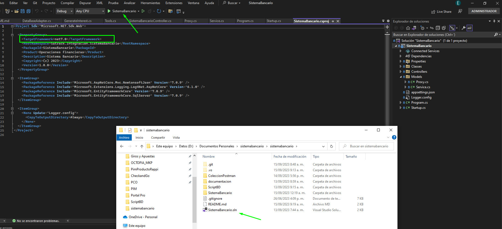

# Instructivo de ejecución Sistema Bancario #

## SistemaBancario ##

| **Área**     | Proceso Satrack |
| ------------ | ------------------------------------------- |
| **Contacto** | Edison Alberto García Aguirre edisongarcia3797@gmail.com|

#### Tabla de contenido

- [Crear base de datos](#crear-base-de-datos)
- [Ejecutar script](#ejecutar-script)
- [Importar postman](#importar-postman)
- [Ejecutar proyecto](#ejecutar-proyecto)

SistemaBancario.postman_collection.json

#### Crear base de datos

1. Crear la base de datos con nombre SISTEMABANCARIO en una instancia local de SQL Express

#### Ejecutar script

1. Ejecutar script con nombre ScriptCreateDataBase.sql ubicado en el directorio que describe la imagen.

 
 #### Importar postman

1. Importar la colección de postman con nombre SistemaBancario.postman_collection.json ubicado en el directorio que describe la imagen.

El endpoint QueryProducts, permite consultar los productos asociados a un cliente. Se puede evidenciar en los Body de los Endpont que hay unos datos comentados. Estos datos corresponden
a información pregarga en la base de daos que servirá como insumo para ejecutar el resto de operaciones.

Las 4 operaciones descritas en la prueba, están relacionadas de la siguiente manera:

- QueryProducts: 1.Abrir un producto según los diferentes tipos descritos
- Transaction: 2.Deposito y retiro en cuenta corriente y de ahorro y 3.Cancelar producto
- AverageInterest: 4.Calcular interés en un periodo de tiempo para determinado producto según los intereses que reconoce el banco y el saldo actual del producto

 Adicionalmente, el Endpoint version permite consultar la versión de la API según el Tag    <Version>1.0.0</Version> del proyecto.

 #### Ejecutar proyecto

1. Abrir y ejecutar el proyecto SistemaBancario.sln ubicado en el directorio que describe la imagen.

Consideraciones. Es un proyecto net7.0 desarrollado en Visual Studio 2022 con la versión del SDK en 7.0.306. Si se presenta algún error de compilación, dejo adjunto en la raíz del prouecto el archivo global.json

Una vez haya ejecutado el proyecto, ya el sistema está preparado para ejecutar cada una de las operaciones.
